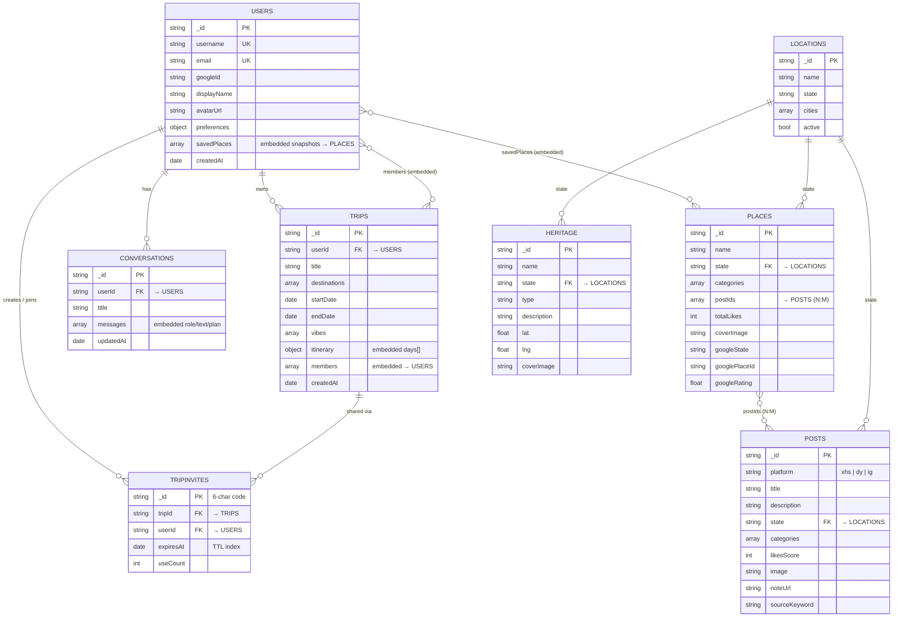

# Travelah — Data Model (MongoDB)

Travelah uses **MongoDB**, a NoSQL **document database**. There are no foreign keys
or joins enforced by the database; relationships are expressed two ways:

- **Referenced** — a field stores another document's `_id` (resolved in code).
- **Embedded** — a sub-document/array is stored *inside* the parent document.

The diagram below is the document-model equivalent of an ERD. Relationship lines
labelled *(embedded)* are arrays nested inside the parent; all others are
references by `_id`.

## Entity–Relationship (document model)

## Collections

| Collection | Purpose | Key relationships |
|---|---|---|
| `users` | Accounts (local + Google), preferences, saved places | owns `trips` & `conversations`; `savedPlaces[]` embed snapshots that reference `places` |
| `posts` | Social posts from RedNote / TikTok / Instagram | `state` references `locations`; aggregated by `places.postIds[]` |
| `places` | POIs extracted from posts (Explore) | N:M with `posts` via `postIds[]`; `state` → `locations`; Google-enriched fields |
| `locations` | Canonical Malaysian states & cities | referenced by `posts`, `places`, `heritage` via `state` |
| `trips` | Saved itineraries | belongs to `users`; embeds `itinerary{days[]}` and `members[]` (each → `users`) |
| `tripInvites` | Shareable invite codes (TTL-expiring) | reference `trips` and the joining `users` |
| `conversations` | AI concierge chat history | belongs to `users`; embeds `messages[]` |
| `heritage` | Curated heritage sites (Heritage page) | `state` → `locations`; saveable like `places` |

## Notes
- **Embedded vs referenced** — `savedPlaces`, trip `members`, trip `itinerary`,
  and conversation `messages` are embedded for read performance (always fetched
  with the parent). Cross-entity links (`userId`, `tripId`, `postIds`, `state`)
  are references resolved in the API layer.
- **No `locations` foreign key on `state`** — `state` is a denormalised string
  (e.g. `"Penang"`) that matches a `locations` document by name, kept accurate by
  the inference + Google-geocoding pipeline.
